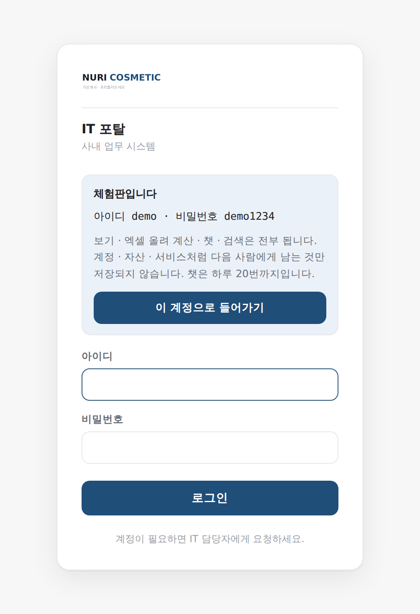
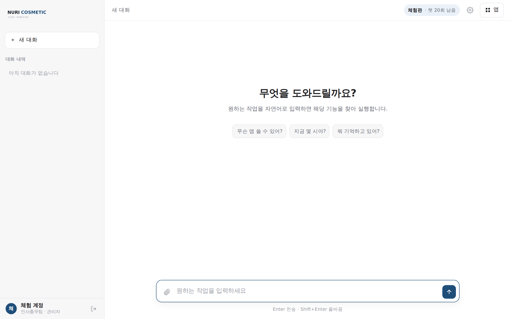

# 사내 AI 챗 포털

직원이 **주소 하나**로 들어와서, **한국어로 물어보면** 사내 앱이 대신 일해 주는 포털입니다.
로그인·권한·이력·AI 비용 관리가 한곳에 있고, 그 뒤에 업무 앱 여덟 개가 붙어 있습니다.

실제로 회사에서 쓰던 것을 **가짜 데이터로 바꿔** 공개한 것입니다.
아래 계정으로 들어가면 전부 눌러 보실 수 있습니다.

> **체험 계정  `demo` / `demo1234`**
> 보기 · 엑셀 올려 계산 · 챗 · 검색은 전부 됩니다.
> 계정 · 자산 · 서비스처럼 **다음 사람에게 남는 것**만 저장되지 않습니다.



---

## 1. 이게 왜 필요했나

IT 담당자 한 명이 회사의 전산을 다 봅니다. 그러다 보면 이렇게 됩니다.

- 팀마다 만든 엑셀 도구가 따로 놀고, 만든 사람이 자리를 비우면 아무도 못 씁니다
- 앱을 하나 더 만들면 **로그인과 권한을 또 만들어야 합니다**
- "이거 누가 쓸 수 있게 해주세요" 가 앱 개수만큼 늘어납니다
- AI 를 붙이면 **월말에 얼마 나갈지 아무도 모릅니다**

그래서 로그인·권한·이력·AI 비용을 **포털 하나가 맡고**, 앱은 자기 일만 하게 나눴습니다.
앱을 새로 붙일 때 만드는 것은 그 앱의 계산 로직뿐입니다.



---

## 2. 무엇이 들어 있나

| 앱 | 하는 일 | 눈여겨볼 곳 |
|---|---|---|
| **포털** | 로그인 · 권한 · 챗 · 이력 · AI 사용량 | 접근 범위(부서/개인/제외) · 사용량 대시보드 |
| **IT 자산 관리** | 자산 · 직원 · IP · 내선 · 자리 · 라이선스 · 렌탈 | 퇴사자 미반납 · 라이선스 초과 배정 잡아내기 |
| **사업계획 예상손익** | 엑셀 둘 → 채널·브랜드·월별 손익표 | **틀렸을 때 숫자를 안 내보내는 것** |
| **연차 이상감지** | 고립 연차 · 저사용 · 몰아쓰기 | 요일 가중치 · 집단연차 제외 |
| **AI 이용 현황** | 게이트웨이 원본 로그 → 대시보드 | 브라우저 안에서 집계 (서버 부담 0) |
| **매뉴얼 가져오기** | PPT → 웹 매뉴얼 자동 변환 | 표를 절차로 펴기 · 작은 그림 버리기 |
| **IT 안내** | 매뉴얼 · 운영 체크리스트 · 비용 · 프롬프트 생성기 | 정적 페이지 4장 |
| **앱 입고 점검** | 받은 앱이 규칙에 맞나 검사 | 규칙을 문서 → 스크립트 → 셀프서비스로 |


---

## 3. 어떻게 얽혀 있나

```
        브라우저
           │
           ▼
    ┌─────────────┐   ① 이 사람이 이걸 써도 되나?
    │    nginx    │ ─────────────────────────┐
    │  (입구 하나) │                          ▼
    └─────────────┘                    ┌───────────┐
           │  ② 되면 그때만 넘긴다      │   포털    │
           │     (X-User-Id 를 붙여서)  │  로그인   │
           ├──────────────┐             │  권한     │
           ▼              ▼             │  챗       │
      ┌────────┐    ┌──────────┐        └───────────┘
      │ 자산   │    │ 사업계획 │  …            │
      └────────┘    └──────────┘               │ ③ 챗은 앱의 API 에
                                               │    물어보고 답만 옮긴다
                                               ▼
                                          같은 숫자
```

**앱은 자기 로그인을 만들지 않습니다.** nginx 가 요청마다 포털에 물어보고
(`auth_request`), 통과하면 그때만 앱으로 넘기면서 누구인지를 헤더에 붙여 줍니다.
앱이 보는 것은 `X-User-Id` 네 줄뿐입니다.

**챗은 계산하지 않습니다.** "우리 팀 자산 현황 알려줘" 를 받으면 자산 앱의 API 를 부르고
그 답을 옮깁니다. 포털이 따로 계산하면 화면과 챗이 **다른 숫자**를 말하게 됩니다.

---

## 4. 만들면서 정한 것들

포트폴리오에서 제일 보실 만한 부분이라고 생각합니다.
"무엇을 만들었나" 보다 **"왜 그렇게 만들었나"** 쪽입니다.

<details>
<summary><b>계산은 앱이, 챗은 옮기기만</b></summary>

챗 안에서 엑셀을 읽어 답하면 빠르게 만들 수 있습니다. 대신 같은 계산이 두 벌이 되고,
어느 날 화면과 챗이 다른 숫자를 말합니다. **그때 어느 쪽이 맞는지 알 방법이 없습니다.**
그래서 챗은 앱의 API 만 부릅니다. 느려지는 대신 숫자가 하나입니다.
</details>

<details>
<summary><b>권한은 토큰이 아니라 DB 를 본다</b></summary>

JWT 안의 값만 믿으면 관리자 권한을 회수해도 토큰이 만료되는 12시간 동안
예전 권한이 그대로 삽니다. 화면에서 메뉴가 안 사라지는 정도가 아니라
**관리자 API 가 계속 열려 있다는 뜻**입니다. 그래서 요청마다 DB 를 한 번 봅니다.
SQLite 조회 하나라 이 규모에서는 체감되지 않습니다.
</details>

<details>
<summary><b>별칭 표를 코드에서 파일로</b></summary>

처음에는 `{'H&B': '헬스뷰티'}` 같은 표가 코드에 박혀 있었습니다.
채널이 늘 때마다 코드를 고쳐 다시 배포해야 하고, 무엇보다
**코드의 이름과 파일의 이름이 어긋나면 그 채널 매출이 조용히 빠집니다.**
지금은 마스터 파일 한 곳에서만 관리합니다.
</details>

<details>
<summary><b>합계 대조만으로는 열 밀림을 못 잡는다</b></summary>

「파일에 적힌 합계」와 「계산 결과」를 맞춰 보면 대부분의 사고가 잡힙니다.
그런데 열이 한 칸 밀린 파일에서는 **둘 다 똑같이 틀린 채로 일치**합니다.
같은 칸에서 읽으니까요. 실제로 41억이 사라졌는데 「일치합니다」가 떴습니다.
그래서 월 이름이 몇 번째 칸에 있는지를 따로 확인합니다.
</details>

<details>
<summary><b>앱은 스스로 등록하되, 스스로 켜지지는 않는다</b></summary>

앱이 뜰 때 포털에 "나 여기 있다"고 알립니다. 이름·설명·검색어를 고치면 저절로 반영됩니다.
다만 **중지 상태**로 들어옵니다. 누가 볼지 정하고 켜는 것은 사람이 합니다.
앱이 스스로 켜지면 아무나 볼 수 있게 되니까요.
</details>

<details>
<summary><b>흔한 이름을 차지하지 않는다 (실제로 사고가 날 뻔했다)</b></summary>

컨테이너 이름이 `portal` · `proxy` · `it-asset` 이었습니다. 사내에서 혼자
쓸 때는 문제가 없지만, 공개 저장소는 **이미 뭔가 띄워 둔 PC 로 갑니다.**

이름이 겹치는 것은 오류가 나니 그나마 낫습니다. 진짜 문제는 이쪽이었습니다 —
`docker compose` 는 이름을 안 적으면 **폴더 이름**으로 프로젝트를 정합니다.
받는 쪽에도 `it-asset` 폴더가 있으면, compose 가 **남의 컨테이너를 이
프로젝트 것으로 보고** `docker compose exec` 를 그 안에서 돌립니다.

실제로 그렇게 됐습니다. 체험판 자료를 넣는 명령이 남의 앱 안에서 실행됐고,
그 앱에는 그 파일이 없어서 실패로 끝났습니다. **있었으면 남의 데이터가
덮였을 겁니다.**

세 가지를 한꺼번에 고쳤습니다.

- 컨테이너 이름을 전부 `demo-` 로 (`demo-portal` · `demo-proxy` …)
- compose 파일마다 `name: demo-<앱>` 을 못 박아 폴더 이름에 기대지 않게
- 자료를 넣을 때 `docker compose exec` 대신 **`docker exec <이름>`** —
  이름 하나만 보므로 헷갈릴 여지가 없습니다

네트워크도 `portal-net` → `demo-net` 으로 바꿨습니다.
</details>

<details>
<summary><b>컨테이너를 하나로 묶지 않았다</b></summary>

앱마다 compose 를 따로 둡니다. 하나로 묶으면 앱 하나 고칠 때마다 전부 재시작합니다.
대신 모두 같은 도커 네트워크에 붙어 **컨테이너 이름으로** 서로를 부릅니다.
`deploy.sh` 가 순서를 압니다 — 포털이 먼저(앱이 등록해야 하니까), 프록시가 마지막(502 방지).
</details>

---

## 5. 체험판 안전장치

공개 데모는 **아무나 눌러 보는 곳**입니다. 로그인을 열어 둔 이상 이런 일이 실제로 일어납니다.

1. 누군가 관리자 화면에서 계정을 지운다
2. 누군가 체험 계정 비밀번호를 바꿔 버린다 ← 그 순간 데모가 끝난다
3. 누군가 챗에 스크립트를 붙여 놓고 잔다 ← 만든 사람 카드로 결제된다

「전부 읽기 전용」으로 만들면 셋 다 막히지만 볼 게 없어집니다.
그래서 기준을 하나로 잡았습니다 — **남는 것만 막는다.**

| | |
|---|---|
| 막지 않는다 | 올리기 · 계산 · 챗 · 검색 · 내려받기 (요청이 끝나면 사라지는 것) |
| 막는다 | 계정 · 자산 · 서비스 · 부서 · 비밀번호 (다음 사람에게 남는 것) |

예외가 하나 있습니다 — **자리 배치도에서 칸 옮기기**는 열어 두었습니다.
남기는 하지만 화면에 되돌리기 버튼이 있고, 틀어져도 배치 자료를 다시 넣으면
원래대로 돌아옵니다. 이 앱에서 제일 보여줄 만한 화면이 배치도인데 막아 두면
눌러 볼 것이 없어서, **되돌릴 수 있는가**에 무게를 두었습니다.
칸 **만들기 · 지우기 · 사람 앉히기**는 되돌리기로도 안 돌아와서 그대로 막습니다.

막는 자리는 **두 겹**입니다. 서로 못 보는 곳이 다르기 때문입니다.

- `portal/app/demo.py` — 포털 자기 주소를 본다. 미들웨어라 **새 주소도 자동으로 검사를 지난다**
- `proxy/conf.d/00-demo-guard.conf` — 앱 여덟 개를 전부 본다.
  **바꾸는 요청은 전부 막고 안전한 것만 이름을 적어 연다.** 새 앱을 붙이면 막힌 채로 시작한다

챗은 세 겹으로 묶습니다 — **IP 당 하루 20번 · 하루 전체 15만 토큰 · 이번 달 전체 300만 토큰.**

가운데가 있는 이유는 IP 는 바꾸면 그만이기 때문입니다. 달 한도만 두면 한 사람이
하루 만에 다 태울 수 있고, 그러면 남은 한 달 내내 챗이 죽어 있습니다.
하루 한도가 있으면 최악의 날도 **다음 날 아침에 되살아납니다.**
어느 한도에 걸리든 챗만 쉬고 나머지 앱은 그대로 열려 있습니다.

> **앱 입고 점검만 예외입니다.** 이 포털에서 유일하게 「남이 준 파일을 서버에서 푸는」
> 앱이라, 공개된 곳에 그 길을 열어 두지 않았습니다. 체험판에서는 미리 넣어 둔 예시
> 셋(규칙대로 만든 앱 · 로그인을 스스로 만든 앱 · 여기저기 틀린 앱)만 검사합니다.
> **검사하는 코드는 올릴 때와 같은 것**을 씁니다 — 예시만 특별 대접을 받으면
> 「예시에서는 되는데」가 되기 때문입니다.

진짜로 막혀 있는지는 설정을 읽는 게 아니라 **바깥에서 요청을 보내** 확인합니다.

```bash
python3 tools/check_demo.py https://내주소
```

파이썬이 없으면(윈도우가 대개 그렇습니다) 컨테이너로 돌려도 같습니다.
도커 네트워크 안에서 프록시를 이름으로 부르므로 주소를 몰라도 됩니다.

```
docker run --rm --network demo-net -v "%CD%\tools:/t" python:3.12-slim python /t/check_demo.py http://demo-proxy
```

```
■ 막혀야 한다 — 다음 사람에게 남는 것
  통과  POST   /api/me/password        403  ← 이게 뚫리면 데모가 끝난다
  통과  POST   /it-asset/api/assets    403
  통과  POST   /manual-import/api/apply 403
  …
■ 열려야 한다 — 계산하고 버리는 것
  통과  POST   /biz-plan/api/run       200
  통과  POST   /manual-import/api/preview 200
```

> 한 번은 이 검사를 통과하는데도 화면에는 안내가 안 뜬 적이 있습니다.
> nginx 가 내보내는 403 본문의 줄바꿈이 **JSON 으로 안 읽히는** 상태였습니다.
> 상태 코드는 멀쩡해서 눈치채기 어려웠습니다. 지금은 본문이 JSON 으로 읽히는지도 함께 봅니다.

---

## 6. 띄우기

**도커만 있으면 됩니다.** 파이썬도 따로 필요 없습니다 —
데이터를 만드는 일까지 컨테이너 안에서 합니다.

윈도우와 리눅스가 **같은 순서, 같은 이름**입니다.

| | 윈도우 (PowerShell) | 리눅스 |
|---|---|---|
| 처음 준비 | `.\setup.ps1` | `./setup.sh` |
| 띄우기 | `.\deploy.ps1` | `./deploy.sh` |
| 하나만 | `.\deploy.ps1 portal` | `./deploy.sh portal` |
| **체험판 전체** | `.\demo.ps1` | `./demo.sh` |
| 서버(nginx 뒤) | `.\demo.ps1 -Behind` | `./demo.sh --behind` |
| 포트 바꾸기 | `.\demo.ps1 -Port 9000` | `DEMO_PORT=9000 ./demo.sh` |

띄우면 **`http://localhost:8090/`** 입니다. 80 이 아닙니다 —
받는 사람의 PC 에는 이미 뭔가 80 을 쓰고 있을 가능성이 높아서,
체험판이 남의 자리를 뺏지 않게 했습니다.

### 윈도우 (Docker Desktop)

```powershell
git clone <이 저장소>
cd chat-portal

# AI 챗까지 보려면 키를 넣습니다. 없어도 나머지 앱은 전부 돌아갑니다.
copy portal\.env.example portal\.env
notepad portal\.env          # OPENAI_API_KEY

.\demo.ps1                   # 이 한 줄이면 끝납니다
```

> `이 시스템에서 스크립트를 실행할 수 없으므로` 오류가 나면 한 번만:
> `Set-ExecutionPolicy -Scope CurrentUser RemoteSigned`

### 리눅스 (서버)

```bash
git clone <이 저장소>
cd chat-portal
cp portal/.env.example portal/.env
$EDITOR portal/.env          # OPENAI_API_KEY

./demo.sh
```

둘 다 하는 일이 같습니다:

1. `setup.sh` — `.env` 들을 만들고 **앱끼리 쓰는 토큰을 서로 맞춥니다**
   (토큰이 한 글자만 달라도 앱이 포털을 못 부르는데 화면에는 단서가 없습니다)
2. 체험판 값을 덮어씁니다 (`DEMO_MODE=1` · 계정 · 한도)
3. `tools/make_demo_data.py` — 가짜 회사 데이터를 만듭니다
4. `deploy.sh` — 순서대로 띄웁니다
5. 각 앱 컨테이너 안에서 **그 앱의 파서를 거쳐** 자료를 넣습니다
6. `tools/check_demo.py` — 안전장치가 진짜로 막는지 확인합니다

두 번 실행해도 안전합니다. 이미 있는 것은 건드리지 않습니다.

### 서버에 올리기 (Azure · AWS · 어디든 우분투)

앞에 nginx 를 두고 HTTPS 를 붙이는 경우:

```bash
./demo.sh --behind          # 127.0.0.1:8081 로만 열립니다
```

자세한 절차(도커 설치 · 방화벽 · 인증서 · 백업)는 [`docs/DEPLOY.md`](docs/DEPLOY.md) 에 있습니다.

---

## 7. 가짜 데이터

전부 가상 회사 **「누리코스메틱」** 의 지어낸 값입니다.
사람·부서·채널을 `tools/demo_company.py` **한 곳**에만 적어 두고 나머지가 읽어 갑니다.
그래야 챗에서 "한윤현 자산 뭐 써?" 를 물었을 때
포털 계정 · 자산관리 · 휴가가 **같은 사람**을 가리킵니다.

숫자만 채우면 표는 차지만 볼 것이 없습니다.
각 앱이 찾아내라고 만든 것을 **일부러 심어 두었습니다.**

```
자산    퇴사자 2명이 노트북·라이선스 미반납 · 라이선스 4개 사서 6명 씀(-2)
        라이선스 2종 곧 만료 · 렌탈 3건 두 달 안에 종료
연차    위험 3 · 검토 6 · 관찰 6 · 저사용 5 · 급증 3   (50명 중)
사업계획 채널 이름 어긋남 · 열 밀림을 넣으면 계산을 멈춤
```

넣는 방식은 **각 앱의 파서를 거칩니다.** DB 에 직접 쓰면 「업로드로는 통과 못 할 자료」가
화면에 앉게 되고, 파서가 망가져도 데모는 멀쩡해 보입니다.
지금은 자료가 보인다는 것 자체가 그 앱이 돈다는 확인입니다.

```bash
python3 tools/make_demo_data.py --force    # 다시 만들기
```

파이썬이 없으면 `tools/Dockerfile` 로 만든 작은 이미지를 씁니다
(`demo.sh` · `demo.ps1` 이 알아서 고릅니다).

```
docker build -t chat-portal-tools tools
docker run --rm -v "%CD%:/w" -w /w chat-portal-tools python tools/make_demo_data.py --force
```

---

## 8. 이 저장소에 없는 것

- **실제 사내 데이터** — 직원 명부 · 자산 대장 · 매뉴얼 원본. 하나도 들어 있지 않습니다
- **회사 이름 · 도메인 · 서버 주소 · 유지보수 업체** — 전부 가상 값으로 바꿨습니다.
  바꾸는 규칙표는 그 자체가 가상 값과 실제 값의 대조표라, 사내 저장소에만 둡니다
- **`.env`** — 열쇠는 저장소에 없습니다. `.env.example` 만 있습니다

원 저작자·회사 확인을 받고 공개한 것입니다.

---

## 9. 만든 것 / 가져온 것

- **포털 · 프록시 · 자산 · 매뉴얼 가져오기 · 연차 · IT 안내** — 처음부터 만들었습니다
- **사업계획 예상손익** — 재무팀이 만든 브라우저용 파이썬(PyScript) HTML 을 서버로 옮겼습니다.
  **계산 코드 976줄은 한 줄도 바꾸지 않았고**, 옮긴 뒤 값 9,436개를 전부 대조해 일치를 확인했습니다.
  점검(precheck) · 화면 · API 를 새로 붙였습니다

---

## 라이선스

MIT. `LICENSE` 참고.
